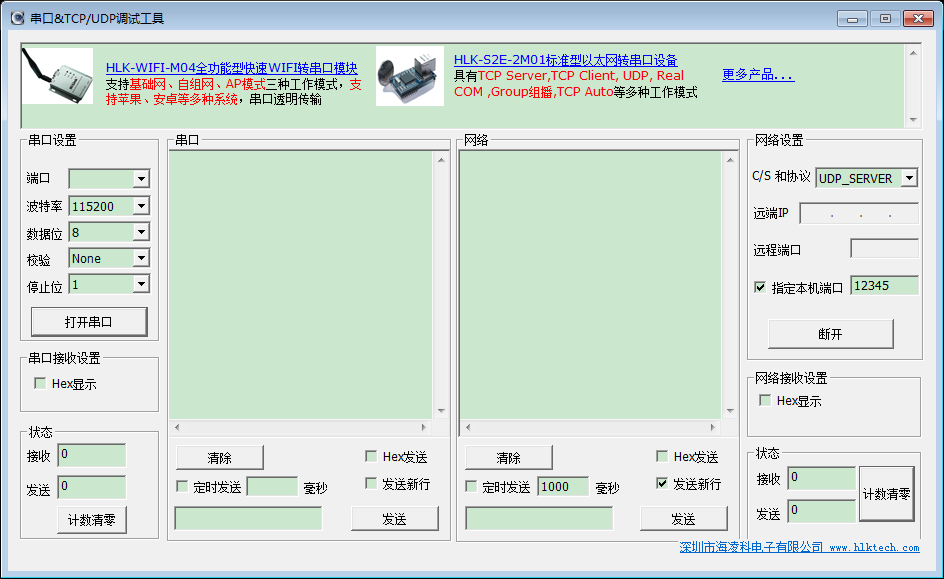

## 一、环境准备
- 1、k68d_DL-S7机器一台，并刷20180411日期后最新的系统软件版本
- 2、确定机器硬件是否Okay(插入网线，机器上电瞬间风口两个灯闪亮一下)
- 3、PC电脑安装Window串口测试软件《串口&TCP_UDP调试工具》
- 4、机器安装CommAssistant.apk操作软件
- 5、确保调试机器及PC机器在同一局域网内

## 二、配置
### 1、串口&TCP_UDP调试工具
* 下载地址：[\\\\f1.y\临时目录\baiwei\Setup.msi](\\f1.y\临时目录\baiwei)

* 网络设置：
    - C/S 和协议选择《UDP_SERVER》
    - 指定本机端口：12345(android软件对应的远程机器端口)

    

点击《监听》按钮即可监听UDP数据，android机器上发送过来的内容会统一显示在《网络》内容栏

### 2、CommAssistant.apk
下载地址：[\\\\f1.y\临时目录\baiwei\CommAssistant.apk](\\f1.y\临时目录\baiwei\)
- 点击《打开网卡模块电源》
- 点击《设置》，设备选择《/dev/ttyMT3》,波特率选择《115200》，点击《确认设置》
- 点击《打开串口》
- 在《输入远程主机IP》中输入《串口&TCP_UDP调试工具》主机上的IP地址（默认10.0.0.41）
- 在《输入远程主机端口》中输入《串口&TCP_UDP调试工具》主机上配置的端口号(默认12345)
- 点击《配置UDP模式》配置网卡模式为UDP模式
- 配置成功，即可在发送区发送数据到服务端(因编码问题，不要发中文)

《AT MODE》栏选项为自动配置，一般不需要修改；显示当前模式为AT模式，发送区内容会附加\r\n内容；切换到《数据模式》发送区内容刚直接发送。

## 三、AT指令
详细AT指令参考：[\\\\f1.y\临时目录\baiwei\W7500S2E-Z1用户手册 V1.2.pdf](\\f1.y\临时目录\baiwei\W7500S2E-Z1用户手册 V1.2.pdf)
